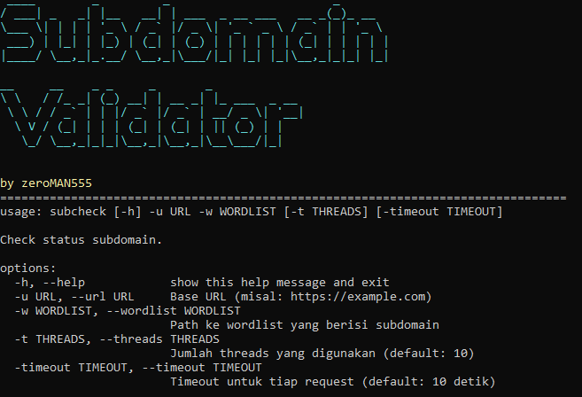

# Subdomain Validator
check subdomain status



**Subdomain Validator** adalah alat yang dirancang untuk memvalidasi ketersediaan subdomain dari daftar yang diberikan. Alat ini akan memeriksa setiap subdomain dan menginformasikan Anda tentang status HTTP yang diterima.

### Fitur
- Memeriksa ketersediaan subdomain.
- Menampilkan status HTTP untuk setiap subdomain.
- Hasil status:
  - **200**: Berhasil (ditampilkan dengan warna hijau)
  - **404**: Tidak ditemukan (ditampilkan dengan warna merah)
  - **403**: Dilarang (ditampilkan dengan warna kuning)
  - **Status lainnya**: Ditampilkan dengan warna sesuai statusnya.

### Instalasi

**Clone Repository**:
   ```bash
   https://github.com/ZeroMAN555/subcheck.git
   cd subcheck
   ```

